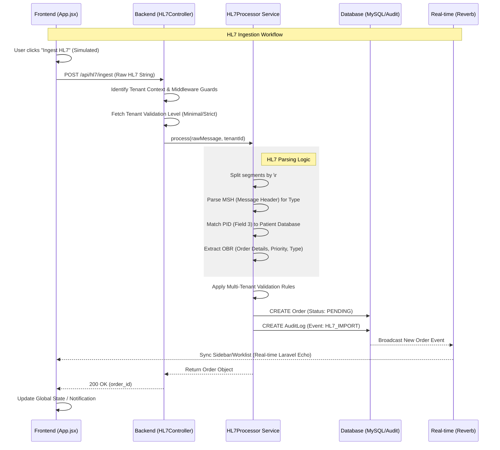

# HL7 Ingestion Process Workflow

This document outlines the end-to-end technical flow for ingesting HL7 v2 messages and transforming them into internal Clinical Orders within the juanclinic HIS.

## 1. High-Level Flow Diagram

## 2. Component Responsibilities

### Frontend (`App.jsx` / `api.js`)
- **Simulation Layer:** Generates a mock HL7 ORM (Order Message) containing the patient's external ID, name, and a requested test (e.g., CBC).
- **Communication:** Sends the raw string via the `ingestHL7` service function.
- **Reception:** Listens for the broadcasted `OrderCreated` event to refresh the Worklist immediately.

### Backend Controller (`HL7Controller.php`)
- **Extraction:** Retrieves the tenant context from the request headers (`X-Tenant-ID`).
- **Policy Enforcement:** Checks tenant-specific settings to determine if the message requires "Strict" or "Minimal" validation.

### Processing Service (`HL7Processor.php`)
- **Parsing:** Destructures the HL7 string into segments.
- **Entity Matching:**
    - **Patient:** Uses `PID-3` to find the internal `patient_id`.
    - **Priority:** Maps `OBR-27` (STAT/ROUTINE).
    - **Type:** Maps `OBR-4` test codes to internal types (LAB/RAD).
- **Persistence:** Creates the database record only if both tenant and patient verification pass.

## 3. Data Integrity & Logging

### Audit Compliance
Every successful ingestion triggers an `HL7_IMPORT` audit event. This log persist:
1. **The Raw Message:** The exact string received from the external source.
2. **Metadata:** Extracted facility and message type headers.
3. **Outcome:** The specific validation level used during ingestion.

### Tenant Isolation
The ingestion process is strictly bound by the `tenant_id`. Messages referencing patients outside the current tenant's scope are rejected with a 422 error, preventing cross-tenant data leakage.

## 4. HL7 Specification Used
- **Version:** v2.3 Compatible
- **Supported Messages:** `ORM^O01` (Order Message), `ORU^R01` (Observation Result)
- **Primary Segments:** `MSH` (Header), `PID` (Patient Identity), `OBR` (Observation Request)
