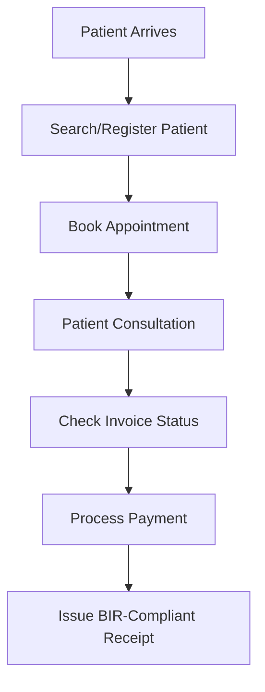
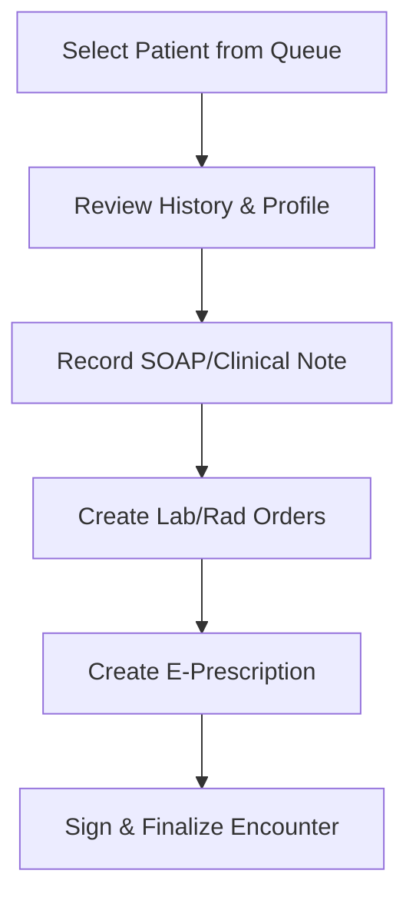
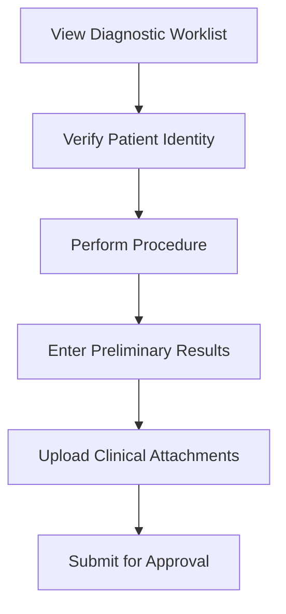
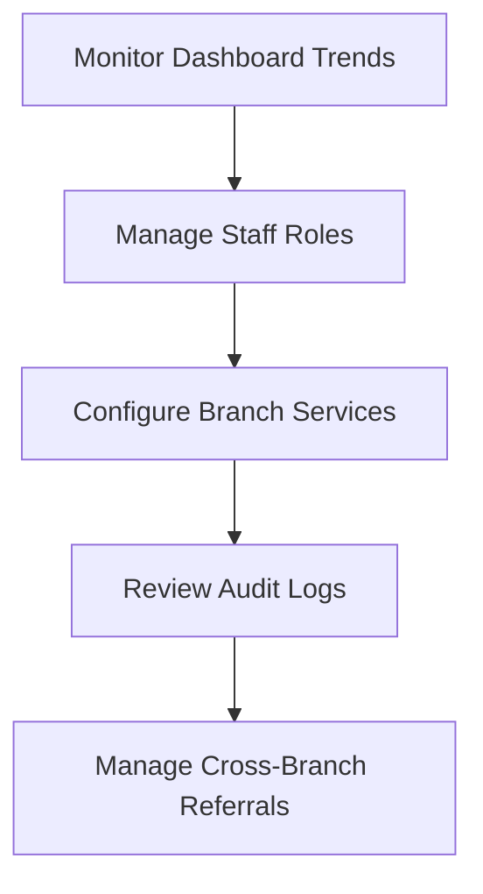
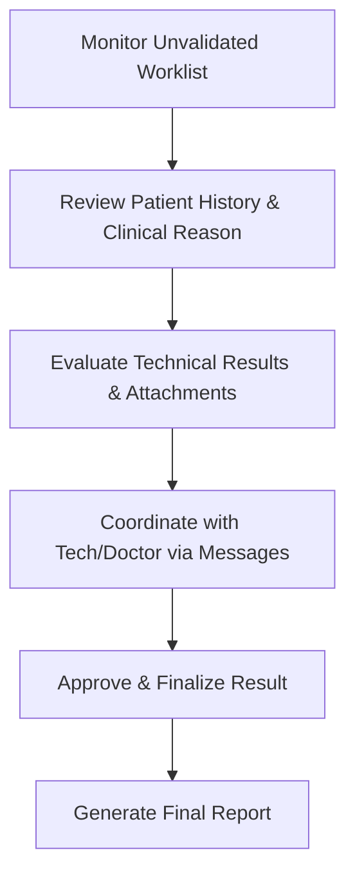

# JuanClinic HIS: Role-Based User Guide & Process Flows

This guide outlines the specific step-by-step workflows for each human personnel role within the JuanClinic HIS, ensuring compliance and operational excellence.

> [!NOTE]
> **What is SOAP?** It is the universal standard for clinical notes:
> - **S (Subjective)**: Chief complaints and symptoms described by the patient.
> - **O (Objective)**: Vitals, physical exam results, and lab data observed by the doctor.
> - **A (Assessment)**: The doctor's professional diagnosis or clinical impression.
> - **P (Plan)**: The treatment strategy, e-prescriptions, and requested follow-up tests.

---

## 1. Front Desk (Reception, Registration & Billing)
*Objective: Patient onboarding and financial settlement.*

### Process Flow

### Step-by-Step Guide
1.  **Patient Search**: Always search for the patient by Last Name or DOB first to avoid duplicates (CDIM Rule 4.1).
2.  **Registration**: If new, create the demographic record including contact details and gender.
3.  **Scheduling**: Assign the patient to a specific **Clinical Provider** and **Branch**.
4.  **Billing**: After the doctor completes the encounter, navigate to the **Billing** module to verify the generated invoice.
5.  **Payment**: Select the payment method (Cash/Card/HMO) and finalize the transaction to generate the clinical receipt.

---

## 2. Clinical Provider (Doctor / Specialist)
*Objective: Diagnostic evaluation, clinical notes, and ordering.*

### Process Flow

### Step-by-Step Guide
1.  **Encounter Start**: Select the assigned patient from your **Branch Worklist**.
2.  **Assessment**: Record the **Clinical Note** (SOAP format) within the patient profile.
3.  **Ordering**: If tests are needed, add **Diagnostic Orders**. These flow automatically to the Technician's worklist.
4.  **Prescribing**: Use the **Prescription Form** to add medications. Note that these are "Active" once finalized.
5.  **Signing**: Finalize the note to ensure it is time-stamped and auditable for PHI access logs.

---

## 3. Specialty Technician (Lab / Radiology)
*Objective: Professional testing and preliminary result recording.*

### Process Flow

### Step-by-Step Guide
1.  **Worklist**: Monitor the **Laboratory/Radiology Worklist** filtered by your current branch.
2.  **Processing**: Select the "Pending" order and verify the patient's identity.
3.  **Result Entry**: Enter the technical results into the structured fields.
4.  **Attachments**: Upload any associated images or scanned PDF results and assign them to the correct **Clinical Category**.
5.  **Submission**: Mark the order as "In Progress" or "Completed" to notify the Doctor/Approver.

---

## 4. Clinic Administrator (Management & Audit)
*Objective: System oversight, staff management, and compliance.*

### Process Flow

### Step-by-Step Guide
1.  **Analytics**: Use the **Reports Dashboard** to monitor revenue and patient throughput across all branches.
2.  **HR Management**: Assign staff to specific branches and ensure they have the correct RBAC role.
3.  **Auditing**: Periodically review the **Audit Engine** to ensure all PHI access events are justified and RA 10173 compliant.
4.  **Referrals**: Approve or manage **Cross-Tenant Referrals** when patients transfer between separate facilities.

---

## 5. Diagnostic Approver (Radiologist / Pathologist)
*Objective: Result validation, finalization, and clinical coordination.*

### Process Flow

### Step-by-Step Guide
1.  **Worklist**: Access the **Diagnostic Worklist** and select "Pending Approval" orders.
2.  **Review**: Open the **Patient Profile** to review previous history and the specific reason for the diagnostic request.
3.  **Validation**: Verify the accuracy of the data entered by the Technician and the quality of clinical attachments.
4.  **Coordination**: If clarification is needed, use the **Messages** module to communicate directly with the **Technician** or the **Ordering Provider** without leaving the patient context.
5.  **Finalization**: Once satisfied, click **Approve**. This locks the record and triggers a notification to the ordering doctor that results are ready.
6.  **Reporting**: Use the **Reports** view to audit throughput and ensure TAT (Turnaround Time) compliance.

---
